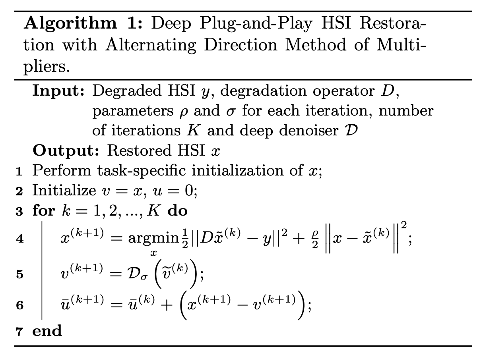

# DPHSIR

[Paper](http://arxiv.org/abs/2209.08240) | [Pretrained Model](https://1drv.ms/u/s!AomvdxwcLmYImDiK2NiIkn_LjsOa?e=PPfex2)

**Deep Plug-and-Play Prior for Hyperspectral Image Restoration (Neurocomputing 2022)**

Zeqiang Lai, [Kaixuan Wei](https://github.com/Vandermode), [Ying Fu](https://ying-fu.github.io/)



## News :sparkles:

- **2021-01-22**: Add a command line client for testing single image or list of images in folders.
- **2021-01-21**: Release demo code for each task.

## Usages

1.  **Install the requirments**

```shell
# Pytorch >= 1.8
conda install pytorch torchvision torchaudio cudatoolkit=11.3 -c pytorch
conda install -c conda-forge opencv
pip install -r requirements.txt
```

1. **Clone the repo**

```shell
git clone https://github.com/Zeqiang-Lai/DPHSIR.git
cd DPHSIR
pip install -e .
```

3. **Run cli or playgrounds**

- Download the [sample input](https://1drv.ms/u/s!AomvdxwcLmYImEc-Yfj2B2FBGEb0?e=vShXe9) if you don't have one.
- Download the [pretrained model](https://1drv.ms/u/s!AomvdxwcLmYImDiK2NiIkn_LjsOa?e=PPfex2), `grunet.pth`, put it in `playgrounds/grunet.pth`.

```shell
# run cli
python cli/main.py -i [input_path] [task]
# run playground
python playgrounds/deblur.py
```

## Citation

If you find our work useful for your research, please consider citing our paper :)

```bibtex
@article{LAI2022281,
    title = {Deep plug-and-play prior for hyperspectral image restoration},
    journal = {Neurocomputing},
    volume = {481},
    pages = {281-293},
    year = {2022},
    issn = {0925-2312},
    doi = {https://doi.org/10.1016/j.neucom.2022.01.057},
    author = {Zeqiang Lai and Kaixuan Wei and Ying Fu},
}
```

## Acknowledgement

- We use some code from [DPIR](https://github.com/cszn/DPIR).
- The training code of GRUNet is [QRNN3D](https://github.com/Vandermode/QRNN3D)
